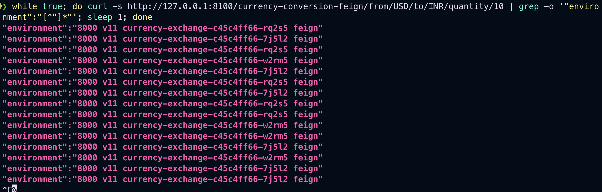
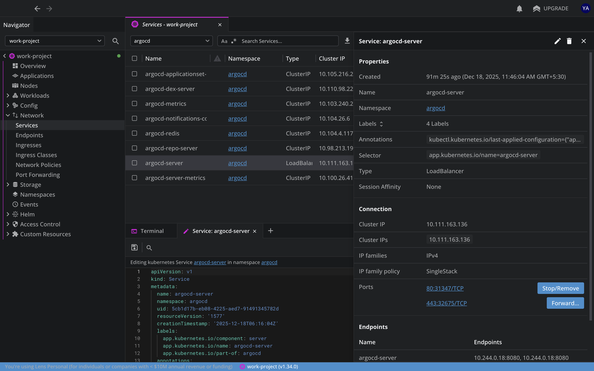
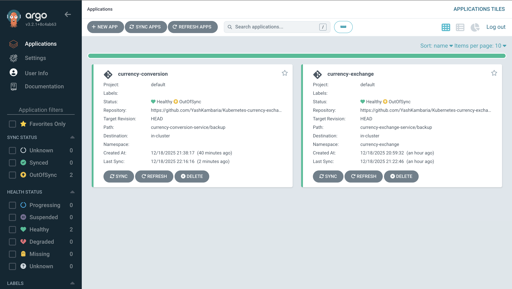
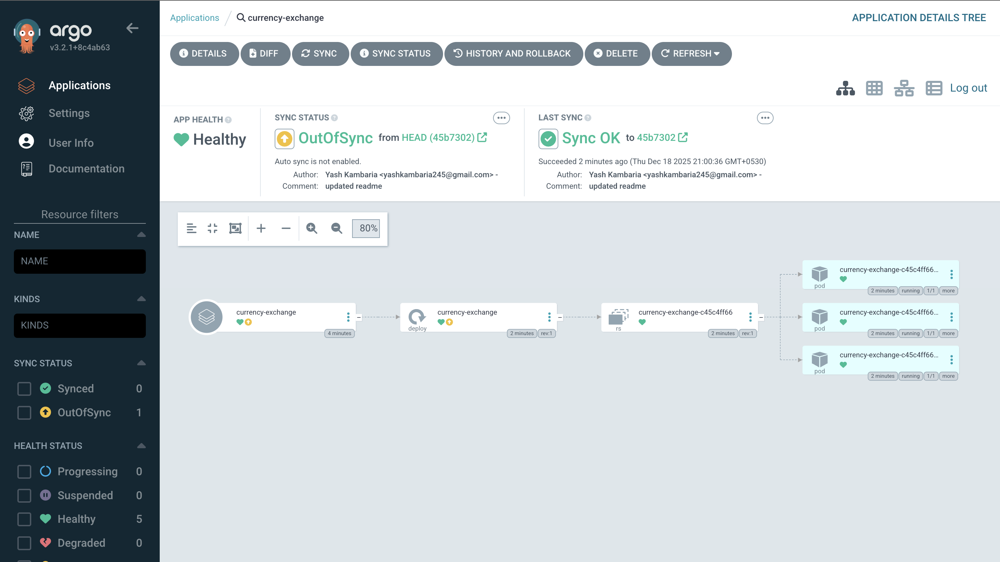
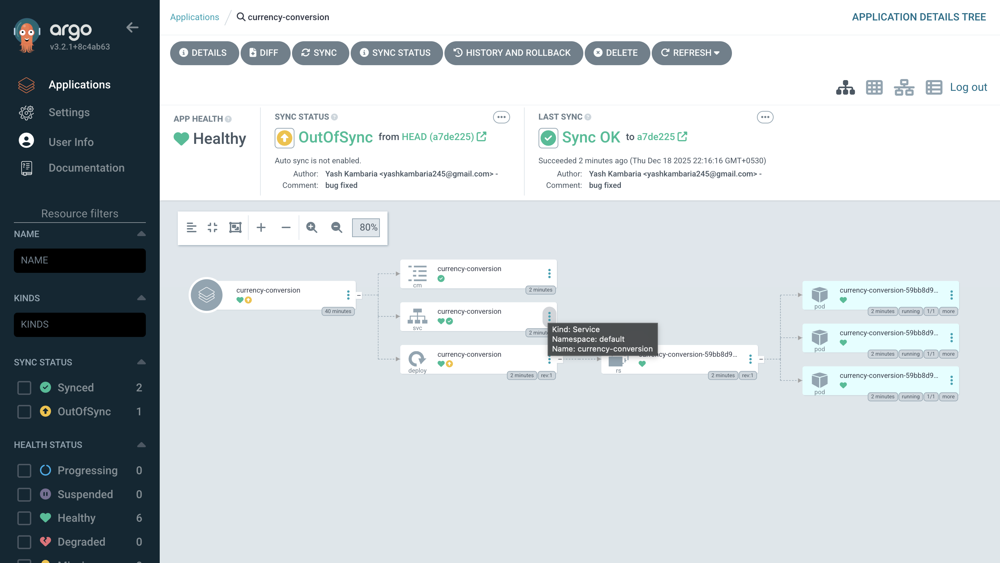

# Kubernetes and Microservices

## What I Learned

### Kubernetes Fundamentals & Architecture
- Learned the fundamentals of Kubernetes along with its overall architecture.
- Understood the responsibilities of the Control Plane and Worker Nodes.
- Gained clarity on how components such as API Server, Scheduler, Controller Manager, etcd, kubelet, and kube-proxy interact.


### Docker Containerization
- Learned Docker containerization concepts in depth.
- Understood the difference between Docker images and running containers.
- Built, tagged, pushed, and reused Docker images for Spring Boot microservices.

### Minikube and Kubernetes Dashboard
- Used Minikube to run Kubernetes locally for development and testing.
- Explored the Kubernetes Dashboard to monitor workloads in real time.
- Observed Pods, Deployments, ReplicaSets, CPU usage, and memory usage directly from the dashboard.


### Practical Load Balancing Implementation
- Implemented load balancing using Kubernetes Services.
- Scaled the Currency Exchange Service to multiple pod replicas.
- Verified load balancing by continuously sending requests and observing traffic being distributed across different pods.



- Confirmed load distribution through:
    - Different pod instance identifiers in responses
    - Real-time CPU and memory usage changes in the Kubernetes Dashboard
- Practically validated Kubernetes’ built-in load balancing mechanism without external tools.

---

### GitOps CI/CD with Argo CD (Milestone Achieved)
- Implemented **GitOps-based Continuous Delivery** using **Argo CD** with Kubernetes.
- Understood the **difference between push-based and pull-based CI/CD** models.
- Used **Git as the single source of truth** for Kubernetes manifests.
- Connected a GitHub repository to Argo CD and deployed applications declaratively.
- Managed **multiple microservices** as independent Argo CD Applications.
- Observed real-time application states such as:
    - `Synced` / `OutOfSync`
    - `Healthy` / `Degraded`
- Practically validated **automatic reconciliation**, where Argo CD restores resources if they are modified or deleted manually.
- Gained hands-on experience with **operational GitOps workflows**, focusing on usage and behavior rather than internal controller implementation.

> Note: At this stage, the focus was on **practical GitOps usage and deployment workflows**.  
> A deeper exploration of Argo CD internals (controllers, reconciliation loops, diffing logic) is planned for a later phase.

---

### GitOps Deployment Model
- **Push-based CI/CD**:
    - CI pipelines push changes directly to the Kubernetes cluster.
    - Higher risk of configuration drift between Git and cluster state.
- **Pull-based GitOps (Argo CD)**:
    - Argo CD continuously pulls the desired state from Git.
    - Kubernetes cluster is automatically reconciled with Git.
    - More reliable, auditable, and production-aligned approach.

---

### Argo CD Dashboard – Practical Observations
- Used the Argo CD Dashboard to:
    - Monitor application health and synchronization status.
    - Visualize Kubernetes resources such as Deployments, Services, and Pods.
    - Trigger manual syncs and observe automated reconciliation.
    - Validate rollouts and updates driven entirely by Git commits.












---

### End-to-End CI/CD Flow Implemented
1. Code changes pushed to GitHub.
2. Kubernetes manifests updated in Git.
3. Argo CD detects changes automatically.
4. Kubernetes cluster state reconciled to match Git.
5. Load-balanced microservices updated without manual `kubectl apply`.


---
## Images

You can reuse these images instead of creating and pushing new container images

- Currency Exchange Service 
	- v11 - yashkambaria/yash-mmv2-currency-exchange-service:0.0.11-SNAPSHOT
  - v11 - yashkambaria/yash-mmv2-currency-exchange-service:0.0.12-SNAPSHOT
- Currency Conversion Service
	- yashkambaria/yash-mmv2-currency-conversion-service:0.0.11-SNAPSHOT
    - Uses CURRENCY_EXCHANGE_SERVICE_HOST
  - yashkambaria/yash-mmv2-currency-conversion-service:0.0.13-SNAPSHOT
    - Uses CURRENCY_EXCHANGE_URI

## URLS

#### Currency Exchange Service
- http://localhost:8000/currency-exchange/from/USD/to/INR

#### Currency Conversion Service
- http://localhost:8100/currency-conversion-feign/from/USD/to/INR/quantity/10


#### Commands
```

docker run -p 8080:8080 in28min/hello-world-rest-api:0.0.1.RELEASE

kubectl create deployment hello-world-rest-api --image=in28min/hello-world-rest-api:0.0.1.RELEASE
kubectl expose deployment hello-world-rest-api --type=LoadBalancer --port=8080
kubectl scale deployment hello-world-rest-api --replicas=3
kubectl delete pod hello-world-rest-api-58ff5dd898-62l9d
kubectl autoscale deployment hello-world-rest-api --max=10 --cpu-percent=70
kubectl edit deployment hello-world-rest-api #minReadySeconds: 15
kubectl set image deployment hello-world-rest-api hello-world-rest-api=in28min/hello-world-rest-api:0.0.2.RELEASE

gcloud container clusters get-credentials in28minutes-cluster --zone us-central1-a --project solid-course-258105
kubectl create deployment hello-world-rest-api --image=in28min/hello-world-rest-api:0.0.1.RELEASE
kubectl expose deployment hello-world-rest-api --type=LoadBalancer --port=8080
kubectl set image deployment hello-world-rest-api hello-world-rest-api=DUMMY_IMAGE:TEST
kubectl get events --sort-by=.metadata.creationTimestamp
kubectl set image deployment hello-world-rest-api hello-world-rest-api=in28min/hello-world-rest-api:0.0.2.RELEASE
kubectl get events --sort-by=.metadata.creationTimestamp
kubectl get componentstatuses
kubectl get pods --all-namespaces

kubectl get events
kubectl get pods
kubectl get replicaset
kubectl get deployment
kubectl get service

kubectl get pods -o wide

kubectl explain pods
kubectl get pods -o wide

kubectl describe pod hello-world-rest-api-58ff5dd898-9trh2

kubectl get replicasets
kubectl get replicaset

kubectl scale deployment hello-world-rest-api --replicas=3
kubectl get pods
kubectl get replicaset
kubectl get events
kubectl get events --sort.by=.metadata.creationTimestamp

kubectl get rs
kubectl get rs -o wide
kubectl set image deployment hello-world-rest-api hello-world-rest-api=DUMMY_IMAGE:TEST
kubectl get rs -o wide
kubectl get pods
kubectl describe pod hello-world-rest-api-85995ddd5c-msjsm
kubectl get events --sort-by=.metadata.creationTimestamp

kubectl set image deployment hello-world-rest-api hello-world-rest-api=in28min/hello-world-rest-api:0.0.2.RELEASE
kubectl get events --sort-by=.metadata.creationTimestamp
kubectl get pods -o wide
kubectl delete pod hello-world-rest-api-67c79fd44f-n6c7l
kubectl get pods -o wide
kubectl delete pod hello-world-rest-api-67c79fd44f-8bhdt

gcloud container clusters get-credentials in28minutes-cluster --zone us-central1-c --project solid-course-258105
docker login
docker push yashkambaria/yash-mmv2-currency-exchange-service:0.0.12-SNAPSHOT
docker push yashkambaria/yash-mmv2-currency-conversion-service:0.0.13-SNAPSHOT

minikube start
minikube image load yashkambaria/yash-mmv2-currency-exchange-service:0.0.12-SNAPSHOT
minikube image load yashkambaria/yash-mmv2-currency-conversion-service:0.0.13-SNAPSHOT


kubectl create deployment currency-exchange --image=yashkambaria/yash-mmv2-currency-exchange-service:0.0.12-SNAPSHOT
kubectl expose deployment currency-exchange --type=LoadBalancer --port=8000
kubectl get svc
kubectl get services
kubectl get pods
kubectl get po
kubectl get replicaset
kubectl get rs
kubectl get all
minikube dashboard

kubectl create configmap currency-conversion --from-literal=CURRENCY_EXCHANGE_URI=http://currency-exchange
kubectl get configmap


kubectl create deployment currency-conversion --image=yashkambaria/yash-mmv2-currency-conversion-service:0.0.13-SNAPSHOT
kubectl expose deployment currency-conversion --type=LoadBalancer --port=8100

//the use the conversino-deployment.yaml from backup of currency-conversion-service

kubectl get svc --watch

kubectl get deployments

minikube tunnel -> in this you will expose the minikube services in your local

//not needed for minikube

kubectl get deployment currency-exchange -o yaml >> deployment.yaml 
kubectl get service currency-exchange -o yaml >> service.yaml 

kubectl diff -f deployment.yaml
kubectl apply -f deployment.yaml

kubectl delete all -l app=currency-exchange
kubectl delete all -l app=currency-conversion

kubectl rollout history deployment currency-conversion
kubectl rollout history deployment currency-exchange
kubectl rollout undo deployment currency-exchange --to-revision=1

kubectl logs currency-exchange-9fc6f979b-2gmn8
kubectl logs -f currency-exchange-9fc6f979b-2gmn8 

kubectl autoscale deployment currency-exchange --min=1 --max=3 --cpu-percent=5 
kubectl get hpa

kubectl top pod
kubectl top nodes
kubectl get hpa
kubectl delete hpa currency-exchange


kubectl get configmap currency-conversion -o yaml >> configmap.yaml

watch -n 0.1 curl http://34.66.241.150:8100/currency-conversion-feign/from/USD/to/INR/quantity/10

docker push yashkambaria/yash-mmv2-currency-exchange-service:0.0.12-SNAPSHOT
docker push yashkambaria/yash-mmv2-currency-conversion-service:0.0.13-SNAPSHOT
```